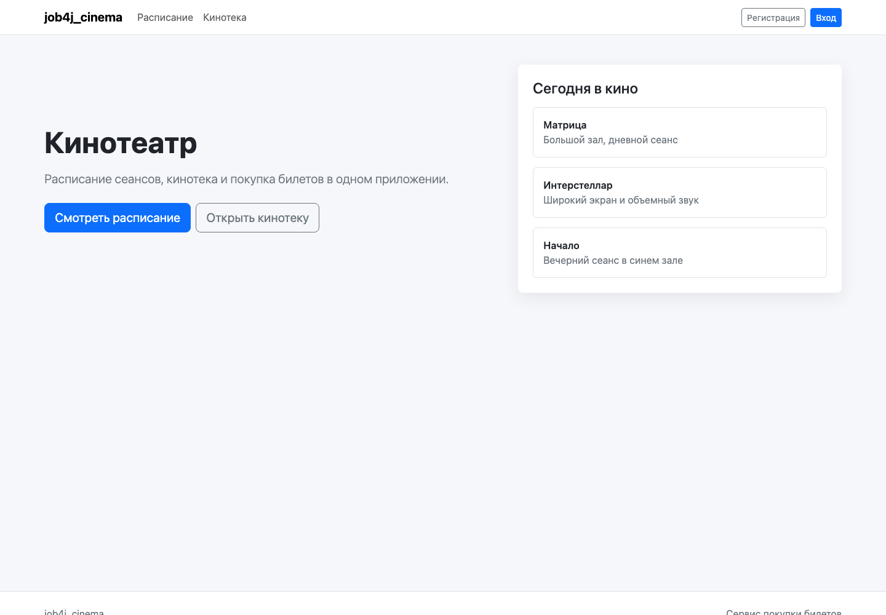
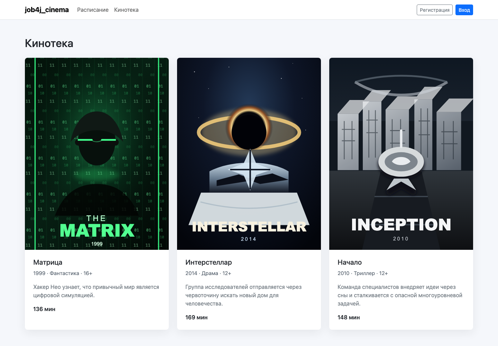
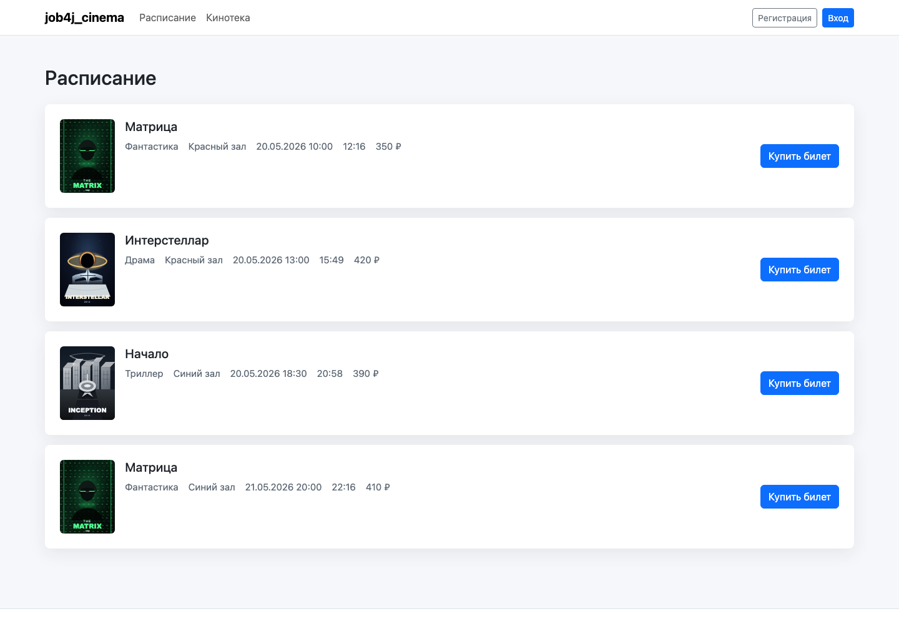
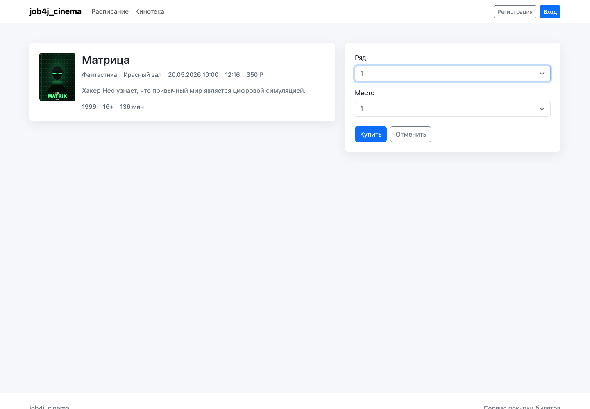
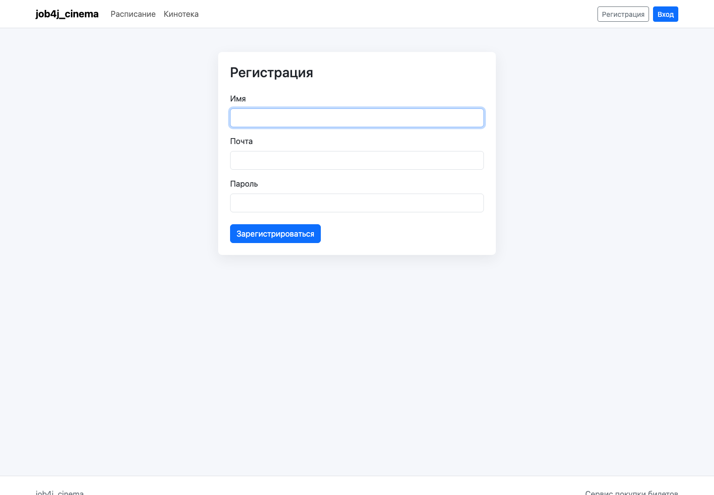

# job4j_cinema

Web-приложение для кинотеатра. Гость может смотреть главную страницу, кинотеку, расписание и форму покупки билета.
Зарегистрированный пользователь может выбрать сеанс, ряд и место, купить билет и увидеть результат покупки.

## Стек

- Java 21
- Spring Boot 3.4.0
- Spring MVC, Thymeleaf
- Bootstrap 5.3.3
- PostgreSQL
- Liquibase Maven Plugin 4.30.0
- Sql2o 1.6.0
- Apache Commons DBCP2
- JUnit 5, Mockito
- Checkstyle, JaCoCo

## Требования

- JDK 21
- Maven 3.9+
- PostgreSQL 14+
- Пользователь PostgreSQL `postgres` с паролем `password`

## Запуск

Создайте production-БД:

```sql
CREATE DATABASE cinema;
```

Создайте тестовую БД:

```sql
CREATE DATABASE cinema_test;
```

Примените миграции:

```bash
mvn -Pproduction liquibase:update
```

Запустите приложение:

```bash
mvn spring-boot:run
```

Приложение будет доступно по адресу:

```text
http://localhost:8080
```

Для пересоздания тестовой схемы:

```bash
mvn -Ptest liquibase:dropAll liquibase:update
```

## Проверка

```bash
mvn test
mvn checkstyle:check
mvn jacoco:report
```

## Сценарии

- Главная страница: `http://localhost:8080/`
- Кинотека: `http://localhost:8080/films`
- Расписание: `http://localhost:8080/sessions`
- Форма покупки: `http://localhost:8080/tickets/buy/{sessionId}`
- Регистрация: `http://localhost:8080/users/register`
- Вход: `http://localhost:8080/login`

Гость при отправке формы покупки перенаправляется на `/login`. После регистрации или входа пользователь может купить
свободное место. Повторная покупка того же места возвращает страницу неудачной покупки.

## Скриншоты

### Главная



### Кинотека



### Расписание



### Покупка билета



### Регистрация



## Контакты

Anton Serdyuchenko, <anton415@gmail.com>
